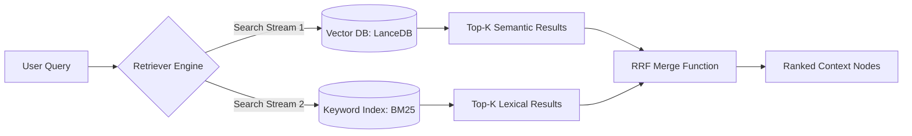

# 🟢 Phase 1: Hybrid Retrieval Engine

**Description:** The foundational layer of the DCO. Traditional RAG relies solely on vector similarity (semantic search), which often misses exact technical terms or specific identifiers. Phase 1 implements a **Dual-Stream Pipeline** that fetches results from both a Vector Store and a Lexical (Keyword) Index, merging them via **Reciprocal Rank Fusion (RRF)** to ensure high-recall and high-precision data retrieval.

---

## 📐 Definition of Technical Design (DTD)

- **Architectural Pattern:** Dual-Stream Ingestion and Retrieval Pipeline.
- **Storage Layer:** LanceDB (Embedded Vector Store) paired with a BM25-compatible sparse index.
- **Merging Algorithm:** Reciprocal Rank Fusion (RRF) with a configurable hyperparameter `k` (default 60).
- **Data Flow:** Asynchronous parallel execution of semantic and lexical search streams to minimize latency.

---

## ✅ Definition of Done (DoD)

- **Performance:** Combined retrieval (Dense + Sparse) executes in **< 400ms**.
- **Ingestion:** Successfully parses and indexes Markdown, JSON, and PDF formats with consistent chunking.
- **Accuracy:** RRF output demonstrates a higher Recall@10 than standalone vector search in technical benchmark tests.
- **Security:** All retrieved nodes are filtered by a `user_id` metadata tag at the database level.
- **Code Quality:** 100% of the retrieval logic is typed in TypeScript with unit tests for the RRF merge function.

---

## 🛠️ Domain Concerns & Work Items

- **W1.1: Multi-Stream Indexing:** - Implement the **LanceDB** vector store for semantic embeddings.
  - Implement a **BM25** (sparse) index for keyword-matching logic.
- **W1.2: RRF Merge Logic:** - Develop a mathematical fusion function to combine disparate ranking scores into a unified list.
- **W1.3: Chunking Strategy:** - Create a "Smart Splitter" that respects code blocks and technical headers to prevent context fragmentation.

---

## 📊 Logic Flow

