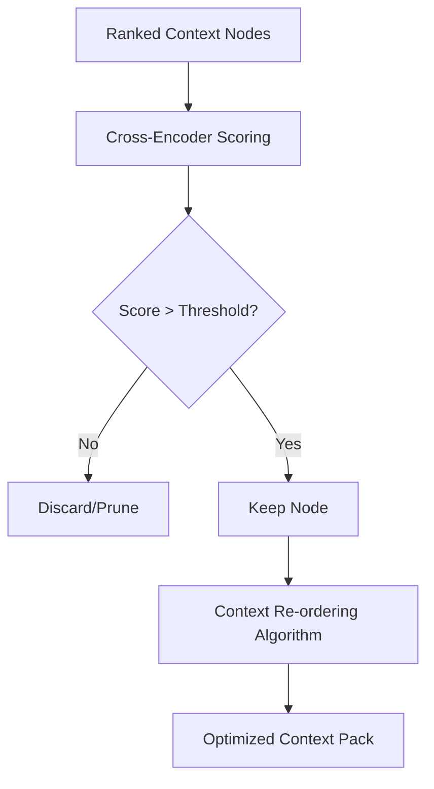

# 🟡 Phase 2: Semantic Reranker & Pruner

**Description:** Retrieval systems are often "wide," returning many documents that are conceptually similar but factually irrelevant. This phase introduces a **Cross-Encoder model**—a highly accurate but slower transformer—to act as a gatekeeper. It re-scores the retrieved nodes against the query and aggressively prunes any node that doesn't meet a specific relevance threshold. It then "re-orders" the survivors to combat the "Lost in the Middle" phenomenon.

---

## 📐 Definition of Technical Design (DTD)

- **Architectural Pattern:** Middleware Interceptor Pattern.
- **Model Selection:** Must support `BGE-Reranker-v2` or similar quantized Cross-Encoder executed via **Transformers.js**.
- **Data Structure:** Input must be an array of `ScoredNode` objects; Output must be a `PrunedContextPack`.
- **Latency Optimization:** Implement local-first execution and caching for repetitive query-node pairs to bypass redundant scoring.

---

## ✅ Definition of Done (DoD)

- **Performance:** End-to-end reranking process adds no more than **600ms** to total query latency.
- **Efficiency:** Automated tests verify a **40%+ reduction** in total context tokens while maintaining "Gold" answer nodes.
- **Accuracy:** Reranker successfully places the most relevant node in the **Top 3** positions in 95% of test cases.
- **Observability:** Score logs for each node are correctly piped to the Phase 4 Dashboard for "Trace" visualization.
- **Code Quality:** Unit tests achieve **>80% coverage** for the `Reranker` class and `reorderNodes` utility.

---

## 🛠️ Domain Concerns & Work Items

- **W2.1: Relevance Thresholding:** \* Develop logic to set a dynamic "Cutoff Score" (e.g., 0.7) to prevent "noise" from reaching the LLM.
  - Implement a "Hard Drop" for nodes that dilute model attention.
- **W2.2: Lost-in-Middle Reordering:** \* Implement a sorting algorithm that moves the highest-scoring nodes to the `top` and `bottom` of the prompt.
  - Ensure the middle of the context window is reserved for secondary supporting data.
- **W2.3: Inference Latency:** \* Optimize the reranker to run in <500ms using local quantized models.
  - Handle edge cases with very few nodes (1-3) without crashing.

---

## 📊 Logic Flow

