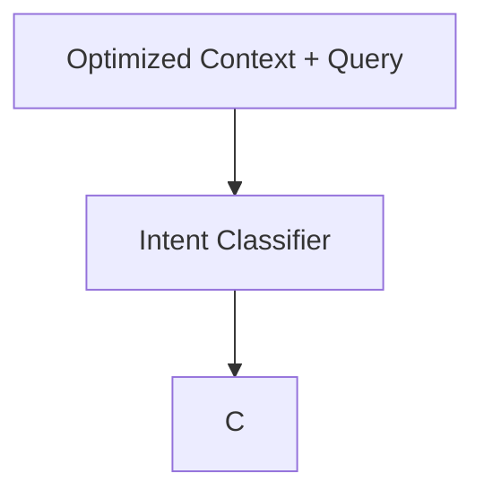

# 🟠 Phase 3: Agentic Intent Router

**Description:** The "Traffic Controller" and FinOps layer of the DCO. This phase analyzes the user's intent and the complexity of the refined context to decide the most efficient execution path. It prevents wasting expensive "Frontier Model" tokens on simple tasks and ensures complex reasoning tasks get the compute power they require.

---

## 📐 Definition of Technical Design (DTD)

- **Architectural Pattern:** Intelligent Gateway / Router Pattern.
- **Classification Strategy:** Uses a high-speed SLM (Small Language Model) or structured output (JSON mode) to tag queries.
- **Routing Logic:** Dynamic provider switching (Groq/Anthropic/OpenAI) based on a `ComplexityScore` (1-10).
- **Fallback Protocol:** If the primary router fails, the system must default to the most "Reliable" model path to ensure zero downtime.

---

## 🛠️ Domain Concerns & Work Items

- **W3.1: Intent Classification:** \* Develop a system prompt that categorizes queries into `FACTUAL`, `REASONING`, or `GREETING`.
  - Implement a "Token Budget" estimator based on the context size from Phase 2.
- **W3.2: Multi-Provider Orchestration:** \* Build a provider-agnostic bridge using the **Model Context Protocol (MCP)**.
  - Implement "Circuit Breakers" for API rate limits.
- **W3.3: Cost-Aware Logic:** \* Create a mapping of Model-to-Price to allow for "Minimum Cost" routing decisions.

---

## 📊 Logic Flow

