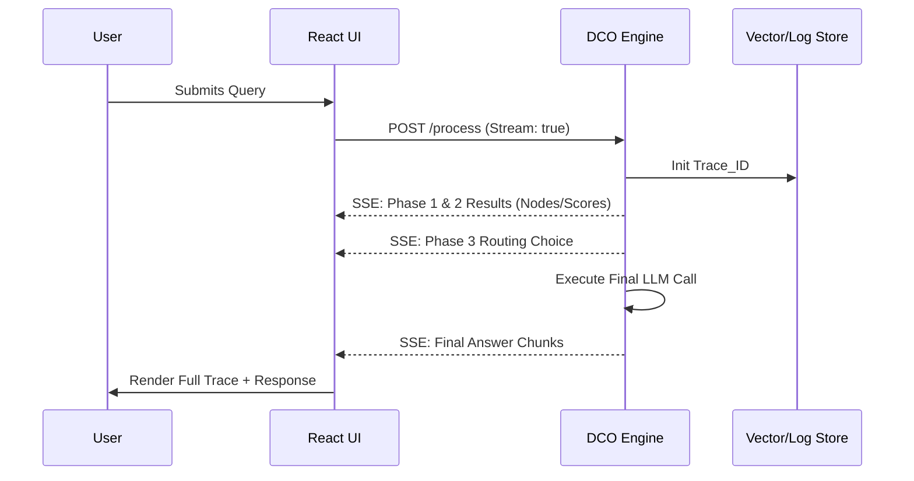

# 🔵 Phase 4: Observability Dashboard

**Description:** The "Transparent Brain" of the DCO ecosystem. For user stories (run query, view trace, feedback, correction, export, theme), see [DASHBOARD_USER_STORIES.md](DASHBOARD_USER_STORIES.md). This React-based interface visualizes the entire execution lifecycle of a query. It provides high-fidelity "traces" that allow developers to see how the system retrieved, reranked, and routed each request. It serves as the primary tool for debugging "Silent Failures" and managing the FinOps of agentic workflows.

---

## 📐 Definition of Technical Design (DTD)

- **Architectural Pattern:** Event-Driven Telemetry Stream using OpenTelemetry (OTel) standards.
- **Frontend Stack:** React with Tailwind CSS and Framer Motion for real-time trace animations.
- **Data Flow:** Uses Server-Sent Events (SSE) to stream "intermediate thoughts" from the DCO engine to the UI before the final LLM response is complete.
- **Schema:** Every trace must conform to the `ExecutionTrace` schema, including `trace_id`, `step_metrics`, and `node_scores`.

---

## Definition of Done (DoD)

Performance: The dashboard renders trace metadata with a latency of < 200ms after the backend event.

Trace Integrity: 100% of queries successfully generate a unique trace_id viewable in the UI history.

Visual Fidelity: The "Context Pruning" visualization accurately reflects the mathematical scores assigned in Phase 2.

Feedback Functional: User feedback (up/down votes) is successfully persisted to the database and linked to the specific trace_id.

FinOps Accuracy: Reported cost metrics match the actual provider billing within a 2% margin of error.

Code Quality: The dashboard includes "Storybook" components for all major UI states (Loading, Trace-View, Error).

---

## 🛠️ Domain Concerns & Work Items

- **W4.1: Trace Visualization Engine:** \* Build a "Timeline" component that maps the transition from Phase 1 (Retrieval) through Phase 3 (Response).
  - Implement a "Node Inspector" to view raw vs. reranked context text.
- **W4.2: FinOps & Token Tracking:** \* Create real-time cost calculators based on provider API pricing (Groq, Anthropic, OpenAI).
  - Develop a "Tokens Saved" visualizer comparing the DCO output vs. a standard Naive RAG approach.
- **W4.3: Feedback & Dataset Loop:** \* Implement "Thumbs Up/Down" and "Edit Correction" features.
  - Build a "Export to Gold-Set" button to turn high-quality traces into future evaluation benchmarks.

---

## 🎮 Playable Dashboard (mock API, no LLM)

To build out the frontend so you can run and explore the dashboard without a real backend or LLM, the following TODOs apply (see `docs/TODOS/`):

- **TODO_15: Mock process / trace API** — In-memory API: submit a query and get back a trace (TraceView-shaped). Optional list/get for trace history. No LLM or external calls.
- **TODO_16: Dashboard layout and query flow** — App layout with header (title + theme toggle), query input + Run button, trace list, and trace detail (TraceView). Run calls mock process; selecting a trace shows TraceView.
- **TODO_17: Wire feedback, correction, and export on trace detail** — On the trace detail view, wire FeedbackButtons to the mock feedback API, EditCorrection to the mock correction API, and ExportGoldSet so the user can vote, correct, and export using existing mocks.

---

## 📊 Logic Flow

