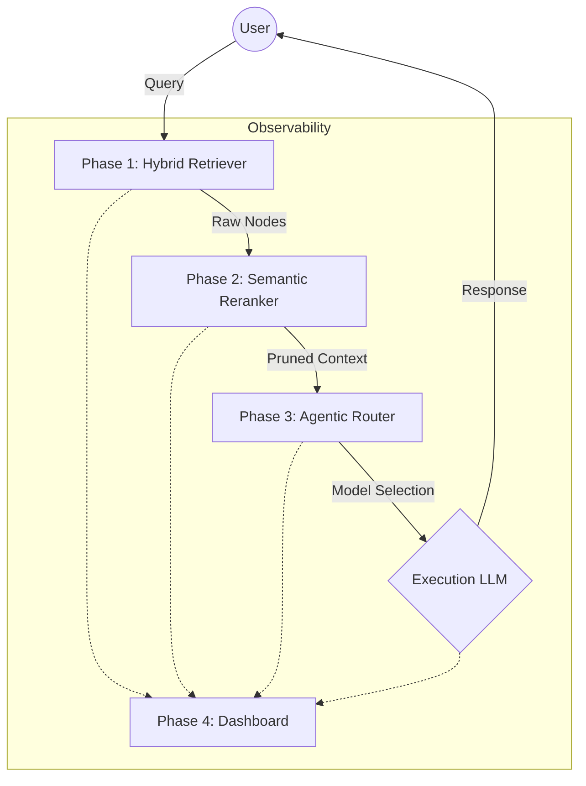

# 🏗️ SYSTEM_DESIGN: Dynamic Context Optimizer (DCO)

**System Version:** 1.0.0  
**Pattern:** Modular Agentic Middleware  
**Core Objective:** Signal-to-Noise optimization for high-token-efficiency RAG.

---

## 1. High-Level Architecture

The DCO is designed as a linear pipeline with telemetry hooks. It intercepts raw user queries and transforms them into high-signal "Context Packs" before they reach the Frontier LLM.

